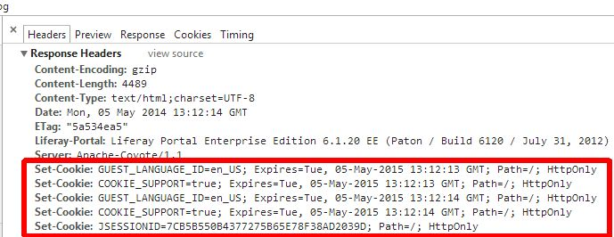
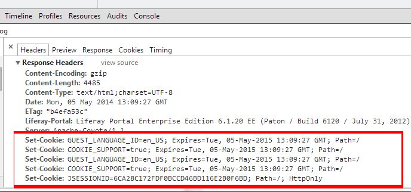

# Adds HttpOnly and secure flags for every cookie

## description

Liferay 6.1.10, 6.1.20, 6.1.30 must use Java EE 5 for compatibility reason which lacks of Cookie.setHttpOnly().
But customers can easily create a filter hook with the SDK which wraps the HttpServletResponse class and sets
HttpOnly in addCookie method:

```
		public void addCookie(Cookie cookie) {

			cookie.setHttpOnly(setHttpOnlyFlag);
			super.addCookie(cookie);

		}
```

For detailed source, see the HttpOnlyCookieFilter.java file in docroot\WEB-INF\src.

If you want to compile this, you should change the servlet-api.jar in the SDK's lib directory to the one
from your app-server's lib directory, because the SDK uses an old servlet-api.jar.

## settings

The httponly and secure flags can be switched on/off in the liferay-hook.xml:
```
<init-param>
	<param-name>httponly</param-name>
	<param-value>true</param-value>
</init-param>
<init-param>
	<param-name>secure</param-name>
	<param-value>false</param-value>
</init-param>
```

If secure set to true, the cookies sent back from the browser only if the protocol is HTTPS. So when secure is true, login can be impossible using HTTP.

## test after the hook



## test before the hook



