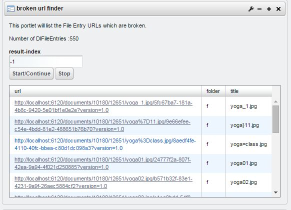

## crontab-portlet

Very easy to create one.

check liferay-portlet.xml
check the class in WEB-INF src folder

For other info, see
http://www.quartz-scheduler.org/documentation/quartz-1.x/tutorials/crontrigger

## broken-url-finder-v2-portlet

A portlet with ajax and AUI datatable with adding rows
It reports broken DLFileEntries in document library

